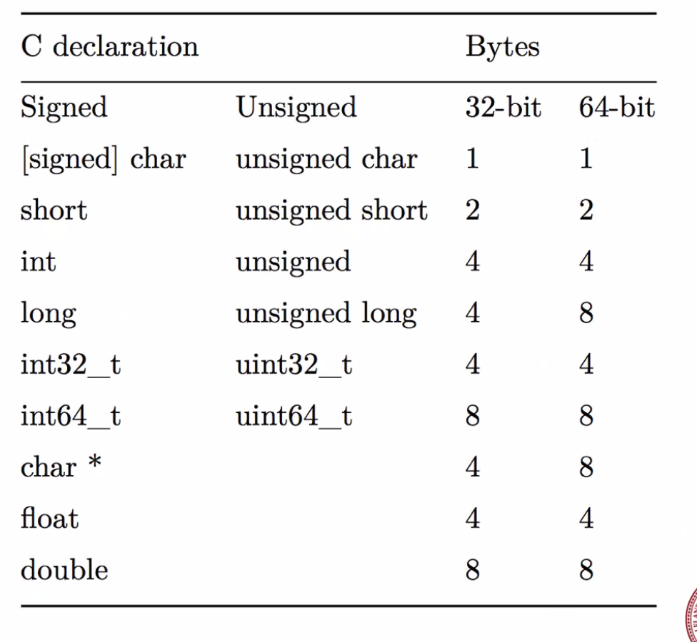

# January 10, 20: Bits and Bytes

## Shifting

- right shift `>>` takes a number and moves bits to the right by however many you tell it to
  - e.g. `short a = 6; a >> 1` turns `0110` to `0011` (divides by 2). Right shifts seem to follow pattern of $2^{shifts}$
- left shift `<<` does the exact opposite
- for unsigned numbers, zeroes are shifted in. For signed, 1s are shifted in

## What is GDB?

- **GDB** is a behind-the-scenes debugger
  - Usage: `gdb program_name`
  - Misc commands:
    - `list`: prints program
      - `list lineNum`: prints around certain lineNum
    - `break <lineNum>`: runs and stops the program BEFORE lineNum
    - `n`: run line that it's done
    - `p <varName>`: print variable
      - `p/x` prints in hexadecimal
      - `p/t` prints in binary
    - `where`: tells you the line you're about to run
    - `x`: show location in memory. **Confusion: what is the difference between x/b and x/x?**
      - i.e. `x/4b &i2`: show the 4 bytes for var i2
    - **little-endian machines**: ends of hexidecimals appear at lowest positions in memory (when they are longer than 1 byte). *Everything seems backwards!*
    - cramming variables into others with lower byte spaces always eat up the least significant parts of the numbers first
- **overflow** and **underflow** exist for signed and unsigned integers
  - signed overflow: wraps around to negative number

## Data Sizes



## Boolean Algebra

- `~` = NOT; `&` = AND; `|` = OR; `^` = XOR
  - XOR (exclusive or): only one is true; the other is false
  - these are the _bitwise_ logical operators!
- Sidenote: There is a super cool XOR swap algorithm which swaps 2 values without using a temporary value
- **bit vector**: sets of bits. Read right to left
  - i.e. `bit vector a = [01101001]` represents `set A = {0,3,5,6}`
  - | and & operators create set unions and intersections respectively
- **bit masking**: when you & a number with all 1s, you get the original number. With this logic, we can get a selection of bits inside a hex string

```c
int j = 0x89ABCDEF;
int k = j & OxFF; // get last 2 bytes
int l = j & 0x00FF0000; // gets 0xAB0000
l >> 16; // now l is AB
```

- CHAR_BIT constant defines how many bits each char takes up
