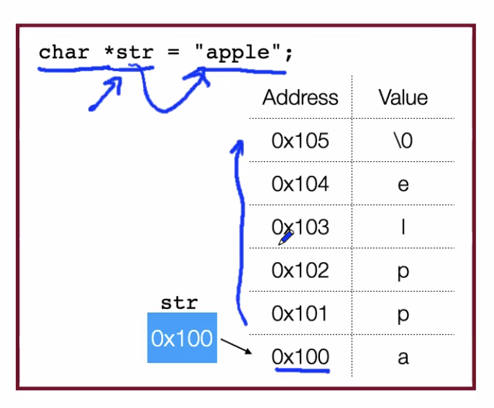

# January 14, 2022: Strings and Chars

> "As it turns out..."
> 
> – Chris Greggs, 2022

## char

- char: one-byte signed (by default) type which is a number, and often represents an ASCII value
- **ctype library**: contains utility functions
  - `isalpha`: 1 if alphanumeric, 0 otherwise
  - `isdigit`, `isalnum`, `islower`, `isupper`, `isspace`, `tolower`, `toupper`

## string

- **string**: in C, a sequence of chars followed by a 0. No helper methods, etc.
  - ∴ there's no way to put `\0` into a string in C... (?)
  - to declare, `char *str = "apple"`
  - referenced by a _pointer_ to its first character
  - it is meaningless to compare strings by their pointer values -- make sure you compare the _values_, not the pointers (and write the function itself)!
  - char* is a NUMBER that is a pointer. If you follow that NUMBER pointer, you get the value.
  - assigning string pointer to another string pointer makes two pointers to the same thing, not 2 duplicates!
  - to dereference pointer, call upon *str and get value (like in C++)!
- string library `<string.h>`
  - `strlen(s)` calculates length of string excluding 0 at the end
  - `strcmp(s, t)` compare+s two strings, character by character.
    - Returns 0 for identical strings
      - `< 0` is s is before t,
      - `> 0` if s is after t
  - `strchr(char *s, int ch)` returns pointer to first occurrence of ch in s, or null if it is not inside the string
  - `strstr(char *haystack, char *needle)` finds substring within a bigger string; the needle within the haystack.
  - `char strcpy(char *dst, const char *src)`: copies src to dst, including null byte. **dst must be set up in advance for src in a very specific way:**
    - `char dst[strlen(s) + 1];`
    - does not put a `null 0` at the end of the string automatically!
    - `char strncpy(char *dst, const char *src, int ntocopy)`
  - `char *strcat(char *dst, char *src)` concatenates two strings by appending src onto the end of dst. Dst is always null-terminated! So make sure there's enough space
  - `char *strncat(char *dst, char *src, int n)` copies n characters of src to dst

