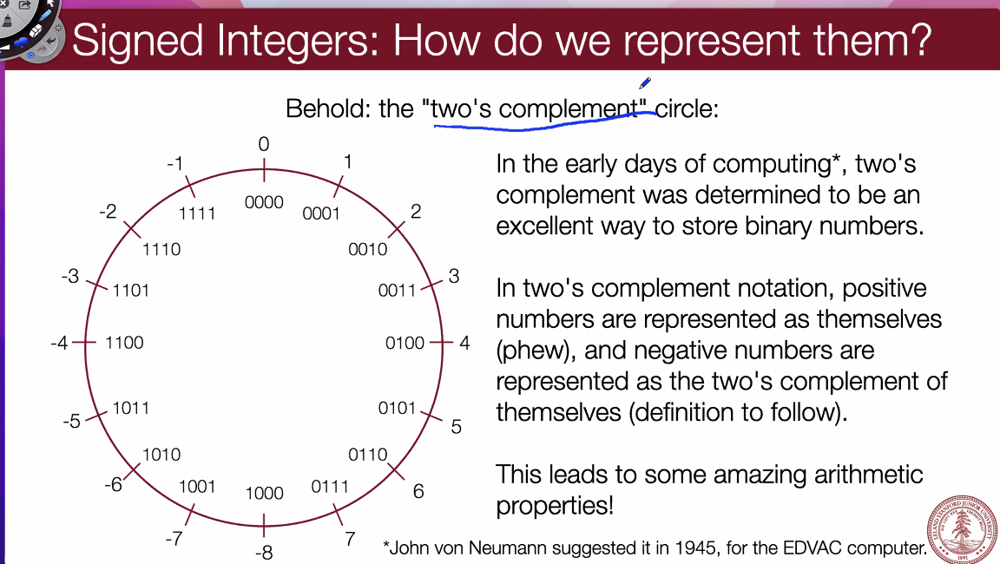
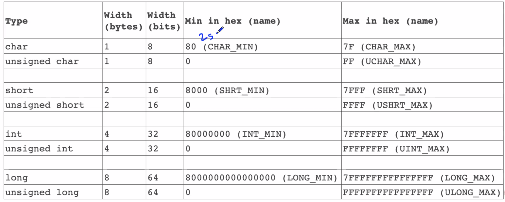

# January 7, 2022: Ints and Representations

## Information Storage

- In C, everything can be thought of as a block of **8 bits** called a *byte*
  - We can use base-16 hexadecimal.
    - 0-9, A-F (F=15)
    - Each unit is to the power of 16.
      - i.e. A1 = $10*16^1+1*16^0$
      - **hex to binary**: take each individual digit, convert to binary equivalent. Append together
      - **binary to hex**: right to left, to hex and append (there will be 2 extra digits in the beginning, *0b*, which indicate it is binary)
      - **decimal to hex**: divide by appropriate base (16). Take remainder as last digit. Then divide quotient by base again. (This procedure goes right to left)
- Each address represents the next byte in memory, a pointer
  - Sounds like a LinkedList
- You can't address / really modify a bit. You can only address @ a byte level.

## Integer Representations

- **unsigned integers**: 1:1 relationship between decimal representation and binary representation.
  - **width**: number of bits that represent the number
    - int: 32; long: 64; char: 8; short: 16, pointers: 64
    - never represent a number bigger than its width!
  - range of unsigned numbers: [0, $2^w-1$]
    - so for int, range = [0, $2^32-1$]
  - Declare with `unsigned int x`
- **signed integers**: can represent positive and negative
  - **two's complement circle**:
    - A two's-complement number system encodes positive and negative numbers in a binary number representation. The weight of each bit is a power of two, except for the most significant bit, whose weight is the negative of the corresponding power of two.
    - a negative number in two's complement is obtained by inverting all the bits of its positive counterpart and adding 1.
    - Trick: to convert positive to negative, start from right of the number, write down all digits until you get a 1, then invert the rest of the digits.
    - To add: just add
    - To subtract: convert number to its twos complement version, then add
    - To multiply: multiply, throw away excess digits



You can cast between signed and unsigned!

- **explicit**: do it explicitly
- **implicit**: same thing, but don't explicitly cast (should automatically do so, if you do it right)

```c
int tx, ty;
unsigned ux, uy;

tx = (int) ux;
uy = (unsigned) ty;
```

- `%d`: signed; `%u`: unsigned (for `printf`)
  - `%s` strings, `%zu` pointers
- when comparing signed and unsigned numbers, C turns the signed to unsigned (so don't do this!)
- `sizeOf` reveals how many bytes each data type uses



- to convert data types (i.e. `int` to `long` etc.)
  - if you convert to a _bigger_ data type, just add leading zeroes
  - if you convert to a _smaller_ data type, "you have to be careful" -- Gregg (bruh what does that mean)
  - missed end about converting signed values. Check last slide!
